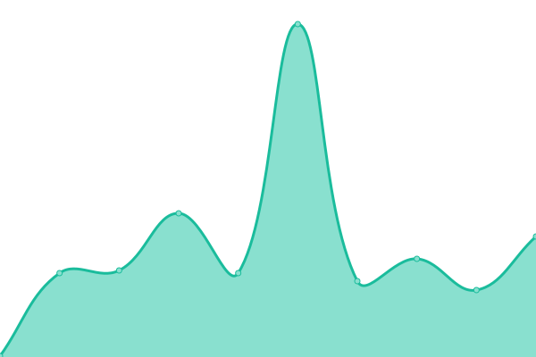
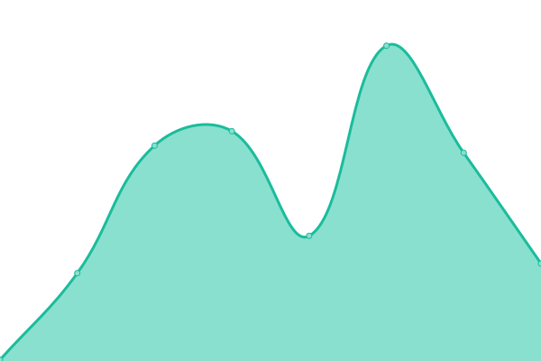
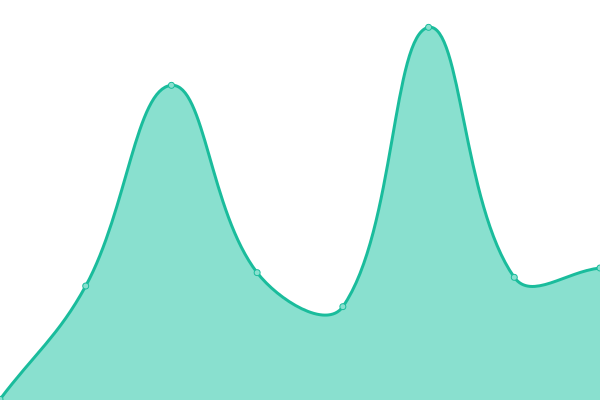

# [📈 Live Status](https://upptime.sorrowblue.com): <!--live status--> **🟧 Partial outage**

This repository contains the open-source uptime monitor and status page for [SorrowBlue](https://upptime.sorrowblue.com), powered by [Upptime](https://github.com/upptime/upptime).

With [Upptime](https://upptime.js.org), you can get your own unlimited and free uptime monitor and status page, powered entirely by a GitHub repository. We use [Issues](https://github.com/SorrowBlue/upptime/issues) as incident reports, [Actions](https://github.com/SorrowBlue/upptime/actions) as uptime monitors, and [Pages](https://upptime.sorrowblue.com) for the status page.

<!--start: status pages-->
<!-- This summary is generated by Upptime (https://github.com/upptime/upptime) -->
<!-- Do not edit this manually, your changes will be overwritten -->
<!-- prettier-ignore -->
| URL | Status | History | Response Time | Uptime |
| --- | ------ | ------- | ------------- | ------ |
|  [Google](https://www.google.com) | 🟥 Down | [google.yml](https://github.com/SorrowBlue/upptime/commits/HEAD/history/google.yml) | 

 128ms
     
 | 

<a href="https://upptime.sorrowblue.com/history/google">100.00%</a>
    

|  [Minecraft Server](http://minecraft.sorrowblue.com:8123/login.html) | 🟥 Down | [minecraft-server.yml](https://github.com/SorrowBlue/upptime/commits/HEAD/history/minecraft-server.yml) | 

 0ms
     
 | 

<a href="https://upptime.sorrowblue.com/history/minecraft-server">0.00%</a>
    

|  [Wikipedia](https://en.wikipedia.org) | 🟩 Up | [wikipedia.yml](https://github.com/SorrowBlue/upptime/commits/HEAD/history/wikipedia.yml) | 

 202ms
     
 | 

<a href="https://upptime.sorrowblue.com/history/wikipedia">100.00%</a>
    

|  [Nature Remo API](https://api.nature.global/1/devices) | 🟩 Up | [nature-remo-api.yml](https://github.com/SorrowBlue/upptime/commits/HEAD/history/nature-remo-api.yml) | 

 286ms
     
 | 

<a href="https://upptime.sorrowblue.com/history/nature-remo-api">100.00%</a>
    

<!--end: status pages-->

[**Visit our status website →**](https://upptime.sorrowblue.com)

## 📄 License

- Powered by: [Upptime](https://github.com/upptime/upptime)
- Code: [MIT](./LICENSE) © [SorrowBlue](https://upptime.sorrowblue.com)
- Data in the `./history` directory: [Open Database License](https://opendatacommons.org/licenses/odbl/1-0/)
